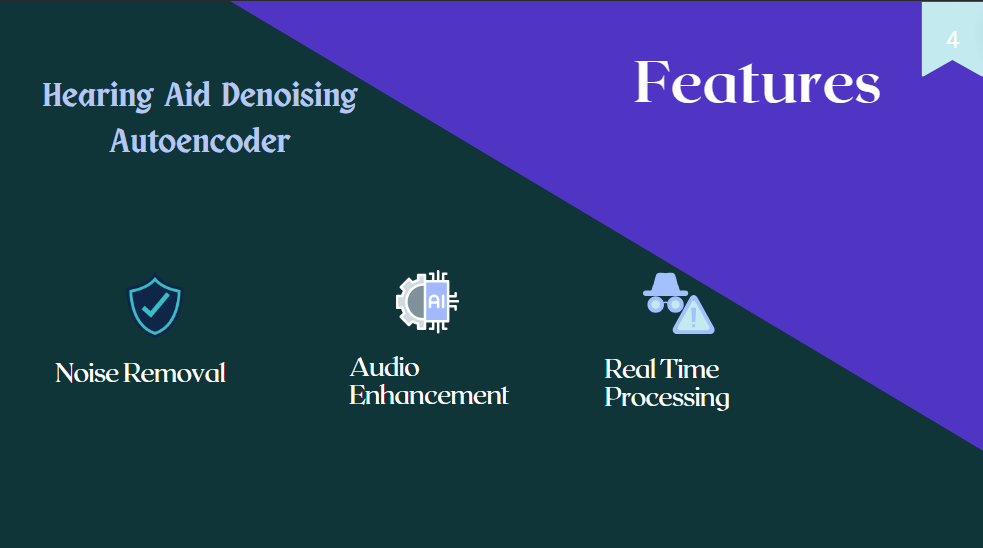

# Hearing Aid Denoising Autoencoder

## Project Description

The project focused on developing an autoencoder model to effectively remove noise from audio signals and enhance overall sound quality. This involved designing a robust architecture, carefully configuring its layers, and optimizing the model to ensure high performance. The autoencoder uses advanced techniques to filter out background noise and provide real-time processing capabilities. The result is significantly improved audio clarity, benefiting applications in telecommunication, music production, and speech recognition, and ultimately enhancing the user experience.

**_Built using TensorFlow, Keras, Python, and various signal processing libraries._**

## 🚀 Objectives

👉 Develop a robust autoencoder architecture for denoising audio signals.  
👉 Optimize the model to achieve high performance and real-time processing capabilities.  
👉 Enhance overall sound quality by effectively removing background noise.  
👉 Provide a flexible and scalable solution applicable to various audio applications.  

## Features and Functionality

🔊 Denoising of audio signals using advanced autoencoder techniques.  
🔊 Real-time processing capabilities suitable for telecommunication and speech recognition.  
🔊 High-performance model optimization for efficient noise removal.  
🔊 Integration with various signal processing libraries for enhanced functionality.  
🔊 Improved audio clarity for applications in music production and sound engineering.  

## 💡 Future Plans

- Explore additional deep learning architectures for further noise reduction.
- Implement dynamic noise estimation and adaptive filtering techniques.
- Extend support for various audio formats and sampling rates.
- Develop a user-friendly interface for easy integration into different applications.
- Conduct extensive testing and validation for different noise profiles and environments.
## How to Build and Run

1. **Data Collection:**
   - Gather a dataset of clean audio samples and separate noise recordings.

2. **Dataset Creation:**
   - Use `DatasetCreator.py` to map separate noises into clean audio samples, creating a dirty dataset.

3. **Spectrogram Creation:**
   - Use `SpectrogramsCreator.py` to create spectrograms of the input (noisy) and output (clean) audio samples.

4. **Model Training:**
   - Use `train.py` to train the autoencoder on the created spectrograms.

5. **Model Testing:**
   - Use `test.py` to predict on a file and evaluate the performance of the autoencoder.

## Technologies Used

- **TensorFlow and Keras:** For building and training the autoencoder model.
- **Python:** For programming and real-time processing.
- **Signal Processing Libraries:** For data preprocessing and feature extraction.
- **Various Audio Libraries:** For handling audio data and formats.

**_NOTE: PLEASE LET ME KNOW IF YOU DISCOVERED ANY BUG OR YOU HAVE ANY SUGGESTIONS_**
